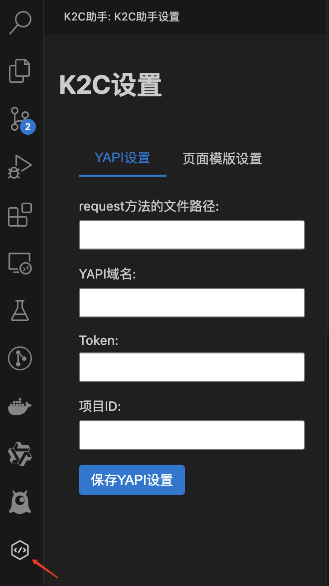
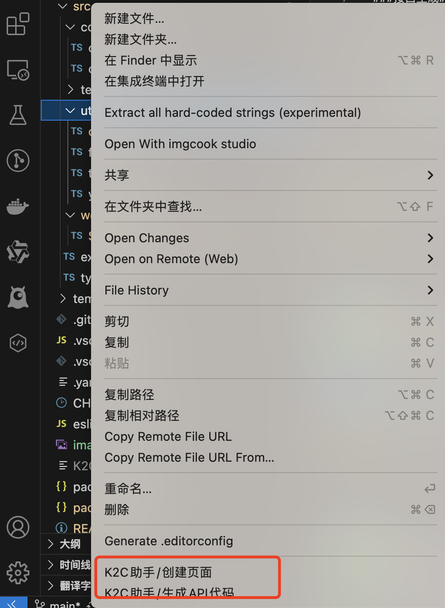

这个插件用于为前端快速生成ts接口函数和页面模版

### 基本配置

### 使用

###接口生成###

先打开项目再点击插件栏的图标完成yapi基本设置，然后右键选择要生成api文件的目录，在对话框中勾选要生成的接口，点确定即可生成接口请求函数

###页面模版生成###

先点击插件栏图标完成模版管理。再到项目下右键点击目录，选择生成页面。再对话框中选择模版，并取好名字，则该目录下将生成一个刚才命名的文件夹，文件夹内包含模版所有的文件
